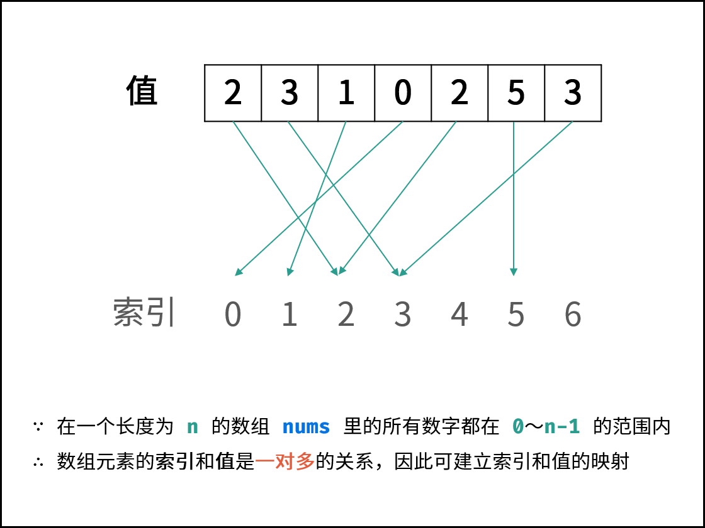

## 找出数组中重复的数字

### 题目描述
在一个长度为 `n` 的数组里的所有数字都在 `0` 到 `n-1` 的范围内。数组中某些数字是重复的，但不知道有几个数字重复了，也不知道每个数字重复了几次。请找出数组中任意一个重复的数字。 

#### 示例 1：
``` 
输入：
[2, 3, 1, 0, 2, 5, 3]
输出：2 或 3 
```
#### 限制：
2 <= n <= 100000

### 解法

#### 解法一
利用哈希表，遍历数组，如果哈希表中没有该元素，则存入哈希表中，否则返回重复的元素。 
##### 复杂度分析：
- 时间复杂度 O(n)： 遍历数组使用 O(n)，HashSet 添加与查找元素皆为 O(1)。
- 空间复杂度 O(n)： HashSet 占用 O(n) 大小的额外空间。
``` go
func findRepeatnumber1(nums []int) int {
	itemMap := make(map[int]bool)
	for _, num := range nums {
		if ok := itemMap[num] ; ok {
			return num
		} else {
			itemMap[num] = true
		}
	}
	return -1
}

```

#### 解法二
排序后，顺序扫描，判断是否有重复，时间复杂度为 `O(nlogn)`。
##### 复杂度分析：
- 时间复杂度 O(nlogn)： 排序源码中采用快排O(nlogn)，遍历数组O(n)，因O(nlogn)>O(n)，结果为O(n*logn)
- 空间复杂度 O(1)
``` go
func findRepeatnumber2(nums []int) int {
	sort.Ints(nums)
	for i := 1; i < len(nums); i++ {
		if nums[i] == nums[i-1] {
			return nums[i]
		}
	}

	return -1
}
```

#### 解法三
题目说明尚未被充分使用，即 在一个长度为 n 的数组 nums 里的所有数字都在 0 ~ n-1 的范围内。 
此说明含义：`数组元素的 索引 和 值 是 一对多 的关系。因此，可遍历数组并通过交换操作，使元素的 索引 与 值一一对应（即 nums[i] = i ）。` 



##### 算法流程：
从头到尾遍历数组，当扫描到下标 `i` 的数字 `nums[i]`：
- 如果等于 `i`，继续向下扫描；
- 如果不等于 `i`，拿它与第 `nums[i]` 个数进行比较，如果相等，说明有重复值，返回 `nums[i]`。如果不相等，就把第 `i` 个数和第 `nums[i]` 个数交换。重复这个比较交换的过程。

 
##### 复杂度分析：
- 时间复杂度 O(n) ： 遍历数组使用 O(n) ，每轮遍历的判断和交换操作使用 O(1) 。
- 空间复杂度 O(1) ： 因为每个元素最多只要两次交换，就能确定位置。空间复杂度为 O(1)。
``` go
func findRepeatnumber3(nums []int) int {
	for i := 0; i < len(nums); i++ {
		for ; i != nums[i] ; {
			if nums[i] == nums[nums[i]] { //交换前校验
				return nums[i]
			} else {
				nums[i],nums[nums[i]] = nums[nums[i]],nums[i] //交换
			}
		}
	}
	return -1
}
```

### 刷题链接
- leetcode: https://leetcode-cn.com/problems/shu-zu-zhong-zhong-fu-de-shu-zi-lcof/
- 牛客网: https://www.nowcoder.com/practice/623a5ac0ea5b4e5f95552655361ae0a8?tpId=13&&tqId=11203&rp=1&ru=/ta/coding-interviews&qru=/ta/coding-interviews/question-ranking