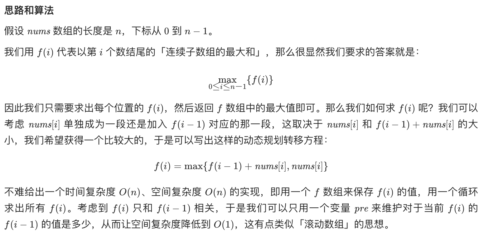

## 找出数组中重复的数字

### 题目描述

输入一个整型数组，数组中的一个或连续多个整数组成一个子数组。求所有子数组的和的最大值。

要求时间复杂度为 O(n)。

#### 示例 1：

```
输入: nums = [-2,1,-3,4,-1,2,1,-5,4]
输出: 6
解释: 连续子数组 [4,-1,2,1] 的和最大，为 6。
```

#### 限制：

1 <= arr.length <= 10^5
-100 <= arr[i] <= 100

### 解法

动态规划思路和算法


